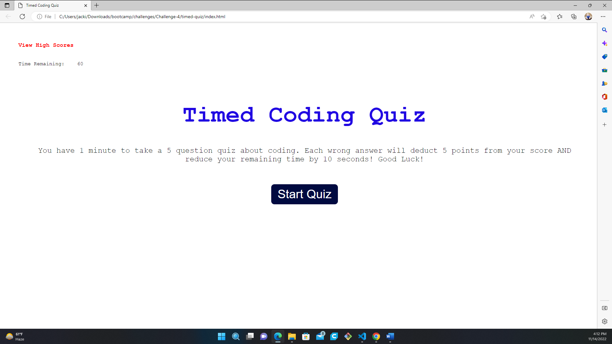

# <Cheeky Coding Quiz>

## Description

My Task:
I was challenged this week to creat a functional and timed quiz. This simple application would serve several functions, such as logging the initials of a user with the high score (the user with the most time left by the time the last question was answered) and sorting said score, a one-minute timer which would automatically end the test the moment it reached 0 if the last question had not yet been answered, and a dynamic page that would automatically load the next question as soon as the previous question was answered.

- I was motivated to accomplish this task by my peers, they assured me that these are skills I should have, and by creating this quiz, I proved both them, and myself, right.
- I built this project to better my skills using mechanics I was not intimitely familiar with, such as logging items to local storage, and working with timers in HTML and JavaScript.
- This project solved many problems, the leading one being giving me confidence in my skills and knowledge I didn't have before accomplishing this goal.
- I learned so much in this project! I learned how to modify classes in HTML with JS, I learned and/or functions, I learned how to implement timers and force reduce them, and I learned how to stringify arrays with JSON and localizing them. All very important and vital skills when working with JS.

## Table of Contents:

- [Installation](#installation)
- [UserStory](#UserStory)
- [Usage](#usage)
- [Credits](#credits)
- [License](#license)
- [Closing](#Closing)

## Installation

-This is an active web page. No installation is required outside visiting my GiHub Repository at https://github.com/RayR124?tab=repositories.

## UserStory

-Below is the user story and acceptance criteria I was given.

[b]AS A coding boot camp student
I WANT to take a timed quiz on JavaScript fundamentals that stores high scores
SO THAT I can gauge my progress compared to my peers

Acceptance Criteria

GIVEN I am taking a code quiz
WHEN I click the start button
THEN a timer starts and I am presented with a question
WHEN I answer a question
THEN I am presented with another question
WHEN I answer a question incorrectly
THEN time is subtracted from the clock
WHEN all questions are answered or the timer reaches 0
THEN the game is over
WHEN the game is over
THEN I can save my initials and my score

Acceptance Criteria Simplified
This project is about creating a quiz game. You will need to do the following:

Have a list of questions for the player. Each question should have at least 4 answers with one being correct. Have at least 2 questions, though more is encouraged!
When the user clicks the start button, show them the first question.
As the user answers questions, move them to the next question until all questions are out.
When no more questions are left, Show the game over screen.
Add in a timer. The timer should start as soon as the start button is clicked, and tick down each second. It should show in the top right corner of the page.
When the user choses an incorrect answer, take some time off the timer. How much is up to you.
When the timer reaches 0, show the game over screen.
Show the last timer value as the player's score on the game over screen.
Give the player the ability to enter their initials, then save them to localstorage along with the score from the game over screen. You should save the data in a format that allows multiple high scores to be saved.
Once the player saves their highscore, show the highscores as a list on the page
Add a link to the top left corner. When clicked, go directly to the highscore list.[/b]

## Usage

-Instructions for use are simple: Navigate the webside as intended. 
-The High Scores tab will show a list of all currently logged High Scores.
-The Start Quiz button will start the quiz as suggested.
-Each "Next Question" button will show the next question (only if the current question was answered correctly).
-and the End Quiz button will stop the timer, log your score, and upon entering your initals will save the score to local storage and display it back on the web page as a new list item.
-There is also a cheeky little game hidden in the web site... see if you can find it!

    

## Credits

-I had no collaborators, I worked on this project solo, though I did recieve vital help and feedback from Robbert Wijtman @ https://github.com/Bucky24.

## License

MIT License

Copyright (c) [year] [fullname]

Permission is hereby granted, free of charge, to any person obtaining a copy
of this software and associated documentation files (the "Software"), to deal
in the Software without restriction, including without limitation the rights
to use, copy, modify, merge, publish, distribute, sublicense, and/or sell
copies of the Software, and to permit persons to whom the Software is
furnished to do so, subject to the following conditions:

The above copyright notice and this permission notice shall be included in all
copies or substantial portions of the Software.

THE SOFTWARE IS PROVIDED "AS IS", WITHOUT WARRANTY OF ANY KIND, EXPRESS OR
IMPLIED, INCLUDING BUT NOT LIMITED TO THE WARRANTIES OF MERCHANTABILITY,
FITNESS FOR A PARTICULAR PURPOSE AND NONINFRINGEMENT. IN NO EVENT SHALL THE
AUTHORS OR COPYRIGHT HOLDERS BE LIABLE FOR ANY CLAIM, DAMAGES OR OTHER
LIABILITY, WHETHER IN AN ACTION OF CONTRACT, TORT OR OTHERWISE, ARISING FROM,
OUT OF OR IN CONNECTION WITH THE SOFTWARE OR THE USE OR OTHER DEALINGS IN THE
SOFTWARE.

---

## Closing

I faced several challenges in the devlopement of this application, such as:
-Discovering the complexity of using the hidden class
-creating a functional countdown timer
-logging the users high scores proved more challenging that initially expected
-creating a function that would close the quiz if the timer elapsed but the final question wasn't answered

Overall, I rather enjoyed creating this application. I found great satisfaction in my triumphs and was rather proud of myself once it all came together. I look forward to using the skills I learned in this project in many more!